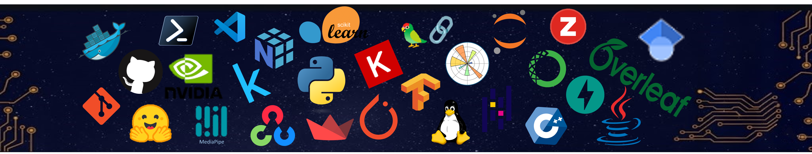
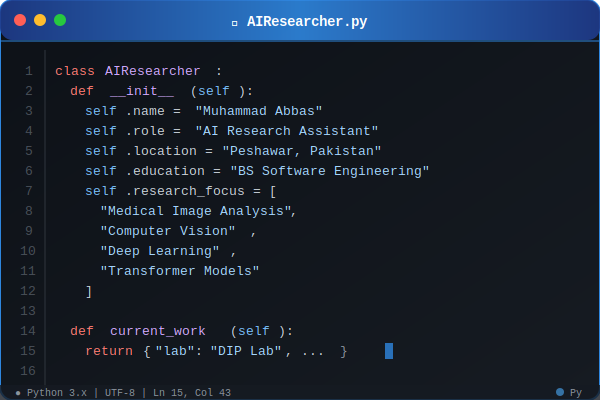

<!-- =============================== -->
<!-- 🌌 Animated Matrix Background -->
<!-- =============================== -->

<!-- =============================== -->
<!-- 👋 Header Section -->
<!-- =============================== -->

  
  <h1>
    
  </h1>
  
  

    
  

  
  

    <em>Digital Image Processing Lab, Islamia College University Peshawar</em>
  

  
  

    
  

<!-- =============================== -->
<!-- 🎯 Focus Areas -->
<!-- =============================== -->

  
  
  
  
  

 

  

  

## 🙋‍♂️ About Me

  <table>
    <tr>
      <td width="50%" align="center">
        
      </td>
      <td width="50%" align="center">
        
      </td>
    </tr>
  </table>

 

### 💡 Research Philosophy

*"Passionate AI researcher and Computer Vision enthusiast, driven by the idea of making machines perceive and understand the world like humans. 
    My journey in Deep Learning revolves around exploring how visual intelligence can be applied to real-world medical and visual systems."*

### 🎯 Key Highlights

- 🔬 **Research Assistant** at Digital Image Processing Lab (ICP)
- 🎓 **BS Software Engineering** – Islamia College University, Peshawar
- 🏆 **Recipient** of Prime Minister Laptop Scheme (2023) based on academic excellence 
- 💊 Working on **Wireless Capsule Endoscopy (WCE)** detection and segmentation
- 🧠 Experienced in **CNNs, Transformers, and Object Detection models**

---

## 🔬 Research Interests

<table align="center">
<tr>
<td align="center" width="33%">

 <strong>Medical AI</strong>
 Deep Learning for Medical Imaging
</td>
<td align="center" width="33%">

 <strong>Computer Vision</strong>
 Transformer-based Vision Models
</td>
<td align="center" width="33%">

 <strong>Edge AI</strong>
 Efficient AI for Low-Resource Devices
</td>
</tr>
</table>

### 🌱 Currently Exploring

- 🎯 Object Detection Architectures (YOLO, DETR, Faster R-CNN)
- 🔄 Vision Transformers and Attention Mechanisms
- 🚀 Model Deployment (TensorFlow Serving, FastAPI, ONNX)
- 📊 Sign Language Recognition & Human Pose Estimation

  

## 🛠️ Technical Arsenal

<table align="center">
<tr><td align="center" width="100%" colspan="6">

### 💻 Programming Languages

</td></tr>
<tr>
<td align="center" width="16.66%">
<!-- 
 JavaScript -->
</td>
<td align="center" width="16.66%">

 Python
</td>
<td align="center" width="16.66%">

 C++
</td>
<td align="center" width="16.66%">

 Java
</td>
<td align="center" width="16.66%">
<!-- 
 HTML5 -->
</td>
<td align="center" width="16.66%">
<!-- 
 CSS3 -->
</td>
</tr>

<tr><td align="center" width="100%" colspan="6">

### 🧠 Deep Learning & AI Frameworks

</td></tr>
<tr>
<td align="center" width="20%">

 PyTorch
</td>
<td align="center" width="20%">

 TensorFlow
</td>
<td align="center" width="20%">

 Keras
</td>
<td align="center" width="20%">

 Scikit-learn
</td>
<td align="center" width="20%">

 Hugging Face
</td>
</tr>

<tr><td align="center" width="100%" colspan="6">

### 👁️ Computer Vision & Data Science

</td></tr>
<tr>
<td align="center" width="16.66%">

 OpenCV
</td>
<td align="center" width="16.66%">

 MediaPipe
</td>
<td align="center" width="16.66%">

 NumPy
</td>
<td align="center" width="16.66%">

 Pandas
</td>
<td align="center" width="16.66%">

 Matplotlib
</td>
<td align="center" width="16.66%">

 Seaborn
</td>
</tr>

<tr><td align="center" width="100%" colspan="6">

### 🛠️ Development Tools & Environment

</td></tr>
<tr>
<td align="center" width="16.66%">

 Jupyter
</td>
<td align="center" width="16.66%">

 Git
</td>
<td align="center" width="16.66%">

 Linux
</td>
<td align="center" width="16.66%">

 VS Code
</td>
<td align="center" width="16.66%">

 Docker
</td>
<td align="center" width="16.66%">

 Conda
</td>
</tr>
</table>

  

## 📂 Featured Projects

<!--

### 🔬 Computer Vision & AI Projects

<table>
<tr>
<td width="50%">
<h3 align="center">OpenCV Python</h3>

Computer Vision projects and tutorials using OpenCV

</td>
<td width="50%">
<h3 align="center">AI Learning Tools</h3>

Collection of AI and Machine Learning utilities

</td>
</tr>
<tr>
<td width="50%">
<h3 align="center">Web Design Bootstrap</h3>

Responsive web design projects with Bootstrap

</td>
<td width="50%">
<h3 align="center">DOM Manipulation</h3>

JavaScript DOM manipulation examples

</td>
</tr>
</table>

  -->

  

## 📊 GitHub Analytics

  
  

  
  

  

  

## 🏆 GitHub Achievements

  

<!-- ## 🏆 GitHub Trophies

  

 -->

---

### 

  

  
  

---

  

  <em>"The best way to predict the future is to create it." – Peter Drucker</em>

